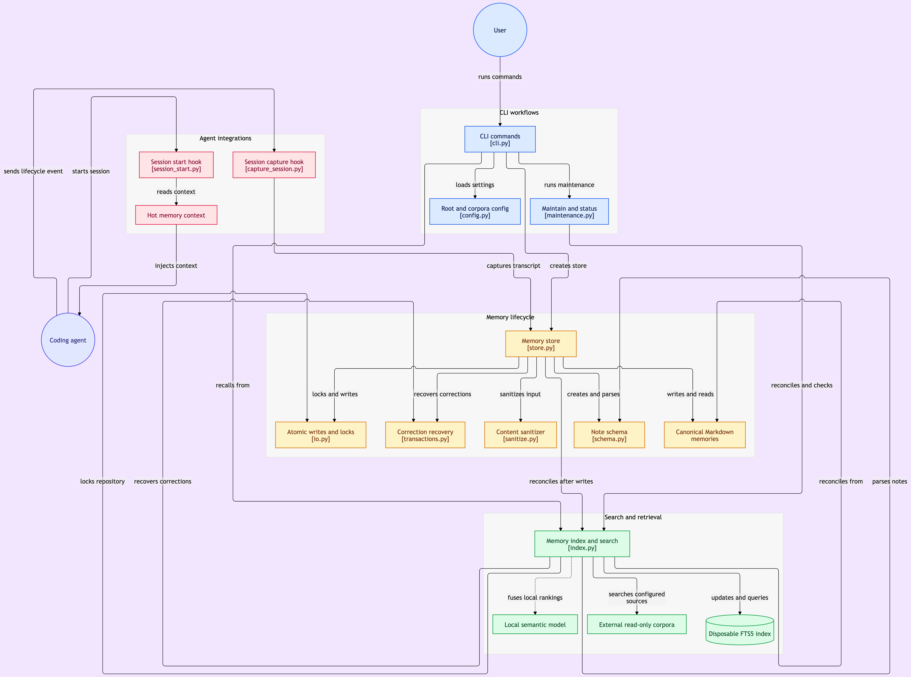

# Engram

*Durable, auditable memory for AI coding agents.*

Coding agents lose decisions, preferences, failures, and project state when a
session ends. Engram keeps that knowledge in reviewable Markdown while treating
search indexes and generated context as disposable views.

Retrieval quality is tested, not assumed: the suite fails if recall@5 drops
below 0.90 on a [20-query seeded evaluation](tests/test_eval_fixture.py).

## Architecture and walkthrough

[](docs/media/architecture.png)

**[Watch the one-minute project explainer →](docs/media/explainer.mp4)**

## Quickstart

```sh
python3.12 -m venv .venv && .venv/bin/python -m pip install -e .
export ENGRAM_ROOT=~/engram-store
printf 'Retries use exponential backoff capped at five attempts' | engram remember --type decision --stdin --json
engram recall 'retry policy' --json
```

Run the tests (71, including the retrieval evaluation) with `make test`.

## Truth model

| Status | Meaning |
|---|---|
| `confirmed` | Canonical local truth that recall may present as authoritative. |
| `inferred` | Plausible evidence that still needs confirmation. |
| `conflicted` | Evidence disagrees and must be resolved before it is canonical. |
| `superseded` | Historical truth replaced by a correction or tombstone. |

## How retrieval works

Engram reconciles canonical Markdown into a disposable SQLite FTS5 index and
ranks lexical matches with BM25. If the optional, pre-provisioned semantic model
is available locally, cosine-similarity results are fused with lexical results
using reciprocal rank fusion; recall never downloads a model.

The seeded evaluation enforces recall@5 of at least 90 percent across 20
queries. See [`tests/fixtures/eval_queries.json`](tests/fixtures/eval_queries.json).

For the storage and recovery design, read
[`docs/architecture.md`](docs/architecture.md). For boundaries and threat
assumptions, read [`docs/security.md`](docs/security.md).

## Agent integrations

The optional installer configures Claude and Codex without replacing unrelated
settings:

```sh
python3.12 integrations/install.py --home "$HOME" --repo-root "$PWD"
```

It installs `integrations/hooks/session_start.py` and
`integrations/hooks/capture_session.py`, the Engram skill, and a CLI symlink.
Review the generated hook commands and grant one-time hook trust in each agent
before relying on automatic session capture.

## Limitations

- Retrieval is lexical (BM25) by default. Semantic ranking only runs after an
  explicit, separate model-provisioning step.
- The recall@5 gate measures a 20-query seeded fixture. It guards against
  regressions but is not a benchmark on real-world agent memory.
- Credential rejection catches obvious secrets by pattern. It is a
  defense-in-depth guard, not a replacement for a secret scanner or review.
- Session capture stores bounded summaries, not full transcripts, so some
  context from a session is intentionally lost.
- Requires Python 3.12 or later.

MIT licensed. Copyright (c) 2026 Utsa Poddar.
